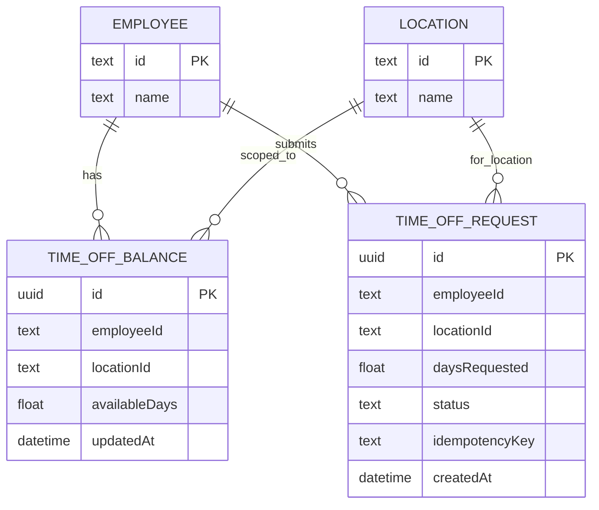

# ERD

```mermaid
erDiagram
  EMPLOYEE {
    text id PK
    text name
  }

  LOCATION {
    text id PK
    text name
  }

  TIME_OFF_BALANCE {
    uuid id PK
    text employeeId
    text locationId
    float availableDays
    datetime updatedAt
  }

  TIME_OFF_REQUEST {
    uuid id PK
    text employeeId
    text locationId
    float daysRequested
    text status
    text idempotencyKey
    datetime createdAt
  }

  EMPLOYEE ||--o{ TIME_OFF_BALANCE : has
  LOCATION ||--o{ TIME_OFF_BALANCE : scoped_to
  EMPLOYEE ||--o{ TIME_OFF_REQUEST : submits
  LOCATION ||--o{ TIME_OFF_REQUEST : for_location
```

## Logical Constraints

- TIME_OFF_BALANCE unique(employeeId, locationId)
- TIME_OFF_REQUEST unique(employeeId, idempotencyKey)
